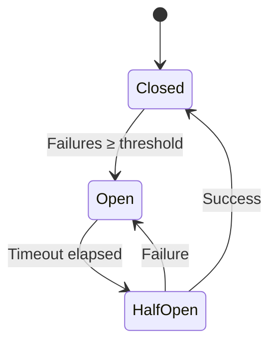

# Manage Workers

This task shows you how to add, remove, and manage inference workers in SMG.

<div class="prerequisites" markdown>

#### Before you begin

- SMG [installed](../../getting-started/installation.md) and running
- Access to inference workers

</div>

---

## View Workers

### List All Workers

```bash
curl http://localhost:30000/workers
```

Response:

```json
{
  "workers": [
    {
      "url": "http://worker1:8000",
      "healthy": true,
      "model": "meta-llama/Llama-3.1-8B-Instruct",
      "requests_total": 15234,
      "requests_active": 5,
      "latency_p99_ms": 245
    },
    {
      "url": "http://worker2:8000",
      "healthy": true,
      "model": "meta-llama/Llama-3.1-8B-Instruct",
      "requests_total": 14892,
      "requests_active": 3,
      "latency_p99_ms": 238
    }
  ],
  "total": 2,
  "healthy": 2
}
```

### Check Worker Health

```bash
# Individual worker
curl http://localhost:30000/workers/http%3A%2F%2Fworker1%3A8000/health

# All workers summary
curl http://localhost:30000/health
```

---

## Static Worker Configuration

### Command Line

```bash
smg \
  --worker-urls http://worker1:8000 http://worker2:8000 http://worker3:8000 \
  --policy cache_aware
```

### Adding Workers

To add workers, restart SMG with the updated list:

```bash
smg \
  --worker-urls http://worker1:8000 http://worker2:8000 http://worker3:8000 http://worker4:8000 \
  --policy cache_aware
```

### Removing Workers

Remove workers by excluding them from the list:

```bash
smg \
  --worker-urls http://worker1:8000 http://worker2:8000 \
  --policy cache_aware
```

---

## Dynamic Service Discovery

Use Kubernetes service discovery for automatic worker management.

### Enable Service Discovery

```bash
smg \
  --service-discovery \
  --selector app=sglang-worker \
  --service-discovery-namespace inference \
  --service-discovery-port 8000 \
  --policy cache_aware
```

### Label Workers

Ensure your worker pods have the matching label:

```yaml
apiVersion: apps/v1
kind: Deployment
metadata:
  name: sglang-worker
spec:
  template:
    metadata:
      labels:
        app: sglang-worker  # Must match --selector
```

### Watch for Changes

SMG automatically detects:

- **New pods**: Added to routing pool when healthy
- **Deleted pods**: Removed from routing pool
- **Unhealthy pods**: Excluded from routing until healthy

---

## Worker Health Checks

### Health Check Configuration

SMG performs periodic health checks on all workers.

| Parameter | Default | Description |
|-----------|---------|-------------|
| `--health-check-interval` | 10s | Time between health checks |
| `--health-check-timeout` | 5s | Timeout for health check requests |
| `--health-check-path` | /health | Health check endpoint path |

```bash
smg \
  --worker-urls http://worker1:8000 \
  --health-check-interval 5s \
  --health-check-timeout 2s
```

### Health States

| State | Description | Routing |
|-------|-------------|---------|
| **Healthy** | Worker responding normally | Receives traffic |
| **Unhealthy** | Health check failed | No traffic |
| **Unknown** | Initial state | No traffic until healthy |

### Manual Health Check

```bash
# Check worker directly
curl http://worker1:8000/health

# Check through SMG
curl http://localhost:30000/workers | jq '.workers[] | {url, healthy}'
```

---

## Circuit Breakers

Circuit breakers automatically remove failing workers.

### Configuration

```bash
smg \
  --worker-urls http://worker1:8000 http://worker2:8000 \
  --circuit-breaker-threshold 5 \
  --circuit-breaker-timeout 30
```

| Parameter | Default | Description |
|-----------|---------|-------------|
| `--circuit-breaker-threshold` | 5 | Failures before opening |
| `--circuit-breaker-timeout` | 30s | Time before half-open |

### Circuit States



### Monitor Circuit State

```bash
# Via metrics
curl http://localhost:29000/metrics | grep circuit_breaker

# Via workers endpoint
curl http://localhost:30000/workers | jq '.workers[] | {url, circuit_state}'
```

---

## Load Balancing

### Change Policy

```bash
smg \
  --worker-urls http://worker1:8000 http://worker2:8000 \
  --policy round_robin  # or: random, power_of_two, cache_aware
```

### Policy Comparison

| Policy | Best For | Considerations |
|--------|----------|----------------|
| `random` | Simple deployments | May cause imbalance |
| `round_robin` | Uniform workloads | Ignores worker load |
| `power_of_two` | Mixed workloads | Good load distribution |
| `cache_aware` | LLM inference | Maximizes KV cache hits |

See [Load Balancing Concepts](../../concepts/routing/load-balancing.md) for details.

---

## Scaling Workers

### Scale Up

1. Deploy new worker pods
2. With service discovery: Automatic detection
3. Without service discovery: Restart SMG with new URLs

### Scale Down

1. Stop routing to target worker (optional grace period)
2. Remove worker pod
3. With service discovery: Automatic removal
4. Without service discovery: Restart SMG without the URL

### Graceful Shutdown

For zero-downtime scaling:

```yaml
apiVersion: apps/v1
kind: Deployment
spec:
  template:
    spec:
      terminationGracePeriodSeconds: 60
      containers:
        - name: worker
          lifecycle:
            preStop:
              exec:
                command: ["/bin/sh", "-c", "sleep 30"]
```

---

## Worker Metrics

### Per-Worker Metrics

```promql
# Requests per worker
sum by (worker) (rate(smg_worker_requests_total[5m]))

# Latency per worker
histogram_quantile(0.99, sum by (worker, le) (rate(smg_worker_latency_seconds_bucket[5m])))

# Error rate per worker
sum by (worker) (rate(smg_worker_requests_total{status=~"5.."}[5m]))
/ sum by (worker) (rate(smg_worker_requests_total[5m]))
```

### Worker Comparison Dashboard

```promql
# Compare worker performance
topk(10, sum by (worker) (rate(smg_worker_requests_total[5m])))

# Find slowest workers
topk(3, histogram_quantile(0.99, sum by (worker, le) (rate(smg_worker_latency_seconds_bucket[5m]))))
```

---

## Verification

```bash
# List workers and health
curl -s http://localhost:30000/workers | jq

# Check specific worker
curl -s http://localhost:30000/workers | jq '.workers[] | select(.url | contains("worker1"))'

# Verify routing is working
for i in {1..10}; do
  curl -s http://localhost:30000/v1/chat/completions \
    -H "Content-Type: application/json" \
    -d '{"model": "llama", "messages": [{"role": "user", "content": "Hi"}], "max_tokens": 1}'
done

# Check request distribution
curl -s http://localhost:30000/workers | jq '.workers[] | {url, requests_total}'
```

---

## Troubleshooting

??? question "Worker not appearing in list"

    1. Verify worker is running and healthy:
    ```bash
    curl http://worker:8000/health
    ```

    2. Check service discovery selector:
    ```bash
    kubectl get pods -l app=sglang-worker
    ```

    3. Verify RBAC permissions:
    ```bash
    kubectl auth can-i list pods -n inference --as system:serviceaccount:inference:smg
    ```

??? question "Worker marked unhealthy"

    1. Check worker health endpoint:
    ```bash
    curl http://worker:8000/health
    ```

    2. Check network connectivity from SMG:
    ```bash
    kubectl exec -n inference <smg-pod> -- curl http://worker:8000/health
    ```

    3. Check worker logs for errors:
    ```bash
    kubectl logs -n inference <worker-pod>
    ```

??? question "Uneven load distribution"

    1. Check current policy:
    ```bash
    curl http://localhost:30000/config | jq '.policy'
    ```

    2. Consider using `power_of_two` or `cache_aware` for better distribution

    3. Check worker capacities are similar

---

## What's Next?

- [Load Balancing Concepts](../../concepts/routing/load-balancing.md) — Understand routing policies
- [Circuit Breakers](../../concepts/reliability/circuit-breakers.md) — Failure handling
- [Monitor with Prometheus](monitoring.md) — Worker metrics
